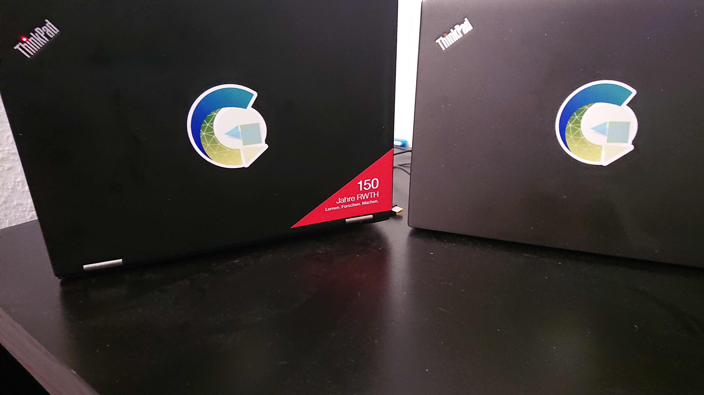
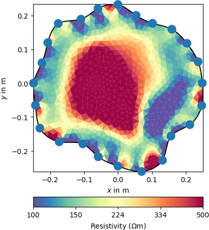
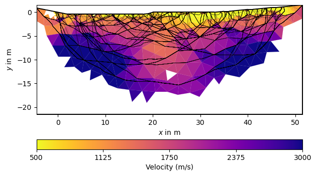
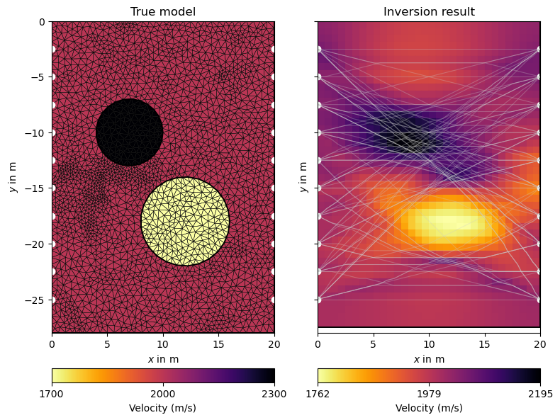

# introducing pyGIMLi 

is rather a box full of tools and not a specific tool

aims at making:

- easy things easy
- hard things possible
- everything transparent and reproducible

##  py**GIMLi** is a versatile open-source toolbox with:
::: {.columns}
::: {.column width="65%" .incremental}
- management tools for **structured and unstructured meshes** in 2D & 3D
- computationally efficient **finite-element and finite-volume solvers**
- **various geophysical forward operators**: ERT/IP, Traveltime, Gravimetry, Magnetics, SP, EM
- frameworks for **constrained, joint and
process-based inversions** with **region-specific regularization**
- **open-source, platform compatible**, documented & tested code
- suitability for **teaching & reproducible research**
- v1.0 published in *Computers and Geosciences* [@Ruecker2017] [(among *Most Downloaded* papers, > 430 citations, > 120 uses in peer-reviewed papers)]{.muted}
:::
::: {.column width="30%"}
::: {.r-stack}


:::
:::
:::

##  Existing tutorials

::: {.columns}
::: {.column .incremental width="55%"}
- [Transform 2021](http://transform21.pygimli.org): creating **geometries & meshes**, **modeling** PDEs, **synthetic data**, **inversion** (also with **external forward operator**).
- [Transform 2022](http://transform22.pygimli.org):  fundamental `pyGIMLi` objects (`Mesh`, `DataContainer`, matrix types, etc.), **geostatistical** vs. smoothness regularization, treatment of subsurface **regions**, adding **prior data**.
- [SEG webinar 2024](http://seg24.pygimli.org): invert **real-life 3D data** [@Huebner2017] to tweak your **inversion beyond the standard** practice. 
- Today we **practise** & focus on **combining near-surface geophysical data** for joint interpretation and inversion.
:::
::: {.column width="45%"}
{width=90%}
:::
:::

##  What is new since?

::: {.noincremental}
- work-in-progress [**user guide**](https://www.pygimli.org/user-guide/) 
- **Improved 3D visualization** powered by [pyvista](https://pyvista.org) (filters, slices, interactivity)
- **3D gravity and (full-tensor) magnetics** operators and managers
- **New matrices and matrix generators**, e.g. non-explicit (PDE-based) Jacobian matrix
- `LSQRinversion` framework to include parameter relations [from @Wagner2019]
- added **Structurally coupled cooperative inversion** (SCCI) as separate inversion class
- `MultiFrameModelling` framework for temporally/spectrally/spatially constraints
- `TimelapseERT` class with different strategies, e.g. **4D inversion**
- **New examples** on ERT (2D/3D crosshole, 3D surface, timelapse), IP, 3D magnetics
- Many more **convenience functions** to simplify the code
- Many **new papers using pyGIMLi** (<https://pygimli.org/publist.html>)
:::

##  New since v1.5.0 (SEG webinar)

https://github.com/gimli-org/gimli/releases

- enabled `pip install pygimli` for easier installation (e.g. on Google Colab)
- new **examples** (e.g. reciprocals) and improved old ones
- better access to **Jacobian, resolution matrices** etc.
- **syntactic sugar** (`data.show('i')`, `mesh.show('res')`, `data.estimateError()`)
- new **mesh functions**:<br> e.g., `submesh()`, `extract2dUpperSurfaceMesh()`, `extract2dSlice()` 
- new **matrix types**, e.g. for BFGS-based inversion
- different **inversion frameworks** (SD, NLCG, GN, L_BFGS, BFGS)
- fully **complex-valued** (FD) ERT-IP inversion (also for TD)
- improvements in **gravity, magnetics and TDEM**
- a lot of of bug fixes and improved docstrings

##  Join the pyGIMLi user community!

::: {.columns}
::: {.column width="50%"}


> "In open source, we feel strongly that to really **do something well**, you have to get a lot of people involved."
>
> *– Linus Torvalds*
:::

::: {.column width="40%" .noincremental}
1. **Join the `#pyGIMLi` chat** on [Mattermost](https://softwareunderground.org/mattermost)!
2. **Open a discussion** or **raise an issue** [on  GitHub](https://github.com/gimli-org/gimli).
3. **Contribute to the website** via the "Improve this page" button in the right sidebar.
4. **Add your** pyGIMLi-powered **publication** to [this database](https://github.com/gimli-org/gimli/blob/dev/doc/gimliuses.bib).
5. **Send your example** to [mail@pygimli.org](mailto:mail@pygimli.org).
6. **Contribute to the code** as described in [our contribution guidelines.](https://pygimli.org/contrib.html)
:::
:::

# The code base -- `ERT` module

:::: {.columns}
::: {.column width="70%"}
- import and export of various formats
- utility functions and data visualization
- array generation and synthetic model simulation
- `ERTManager` for data inversion and model output
- `ERTIPManager` for FD or TD Induced Polarization (IP)
- `TimelapseERT` (and `CrossholeERT`) class for timelapse ERT
- spectral IP analysis in `pyBERT` module (`FDIP` and `TDIP`)
:::
::: {.column width="30%"}

:::
::::


##  The `TimelapseERT` class

- designed for surface ERT data (crosshole: `CrossholeERT`)
- different import formats and export of filtered data
- extract data time series with `.showTimeline()`
- extensive filter function (`t`, `tmin`, `tmax`, `kmax`)
- masking of data with app. resistivity & error bounds (`.mask()`)
- automatic masking based on harmonic filtering
- different types of data visualization and PDF generation
- temporal fitting of reciprocal error models
- invert single timesteps, sequentially or full ("4D" inversion)

##  The `CrossholeERT` class

- based on `TimelapseERT` with some extra functions
- different visualization methods
- adapted mesh generation 
- attributes electrodes to boreholes
- `extractSubset` to retrieve (3D) parts or (2D) planes

 Make whole processing chain transparent and reproducible


# The code base -- `traveltime` module

:::: {.columns}
::: {.column width="50%"}
- import and export of various formats
- utility functions and data visualization
- array generation and synthetic model simulation
- `TravelTimeManager` for data inversion and model output
- several convenience functions to evaluate and visualize results
:::
::: {.column width="50%"}

:::
::::

##  Crosshole traveltime tomography

:::: {.columns}
::: {.column width="50%"}
- based on functions implemented in `traveltime` manager
- `createCrossholeData()` allows to generate synthetic crosshole data
- inversion and evaluation based on functions given in 'traveltime' manager
:::
::: {.column width="50%"}

:::
::::


# The code base -- joint inversion frameworks

:::: {.columns}
::: {.column width="50%"}
- import and export of various formats
- utility functions and data visualization
- array generation and synthetic model simulation
- `TravelTimeManager` for data inversion and model output
- several convenience functions to evaluate and visualize results
:::
::: {.column width="50%"}

:::
::::

##  Cross gradient joint inversion
:::: {.columns}
::: {.column width="50%"}
- please add some important aspects on cross-gradient JI
- and maybe also a nice picture showing the effects comapred to individual inversions 
:::
::: {.column width="50%"}

:::
::::

##  Structurally coupled cooperative inversion (SCCI)
:::: {.columns}
::: {.column width="50%"}
- own class in `pygimli.frameworks`
- allows structurally coupled multi-method inversions 
- coupling strengths adjusted by `scci.a`, `scci.b`, `scci.c`
- visualization of coupling strength per boundary via `drawCWeight`
:::
::: {.column width="50%"}

:::
::::

##  How to get started

1. Open [Miniforge Prompt](https://docs.anaconda.com/free/anaconda/install/) () or a Terminal (/).
2. Follow the [installation guideline](https://www.pygimli.org/user-guide/getting-started/installation/#installation) on the pyGIMLi website.

```bash
conda create -n pg
conda activate pg

conda install -c gimli pygimli
```

::: {.callout-tip}
## Follow without a local installation
You can also visit <https://colab.research.google.com>, open an empty notebook and type `!pip install pygimli tetgen`.
:::

# pyGIMLi's ERT and traveltime managers
 Let's start individual!

##  Goals of this part of the workshop

::: {.incremental}
-   Get familiar with pyGIMLI's method managers for ERT and traveltime data.

-   Learn basic operations such as data import, data filtering, and topography addition.

-   Perform your first inversion using either your own field data or our provided data sets.

-   Get to know the basic image appraisal techniques.

-   Apply tools to compare and jointly interpret individual geophysical data sets.
:::


##  Takeaway messages:
:::{.incremental}
- We familiarized ourselves with the method managers to process and invert ERT and SRT data.

- We loaded, filtered, and inverted field data using pyGIMLi and qualitatively evaluated the results

- We applied tools that allow us to quantitatively compare and qualitatively evaluate the single inversion results, such as...
  * 1D interpolation tools to generate synthetic geoelectrical and acousitic logs
  * data point - wise misfit examination to identify regions of decreased model goodness. 

- We implemented ways to further improve our individual inversions by penalizing individual data points with increased misfit.
::: 

# Constrained and "structurally-informed" inversions 
 There's more than just one data set!

##  Goals of this part of the workshop 

::: {.incremental}
-   Get to know the possibilities if including a-priori information as constraints into inversions.

-   Incorporate geological a-priori information into regularization. 

-   Incorporate information extracted from GPR as constraints in ERT.

-   Apply interactive tools to extract constraints from images or models.
:::


##  Takeaway messages:
:::{.incremental}

- We applied advanced regularization techniques to our individual inversions

- We constrained the individual inversions using 
  * geological borehole information
  * GPR reflections

- We evaluated and compared the constrained models and quantified the effect of adding a-priori information
::: 


# Joint inversion of ERT and SRT data 
 The more, the merrier?

##  Goals of this part of the workshop 

::: {.incremental}
-   Learn the necessary steps to successfully perform a joint inversion.

-   Apply the cross-gradient algorithm to jointly invert SRT and ERT using actual field data.

-   Evaluate and compare the joint inversion results to individually inverted data sets.

-   **Optional:** Apply the algorithm to your own data sets!
:::


##  Takeaway messages:
:::{.incremental}
- fill in main takeaway messages for joint inversion part here
::: 

<!-- 
# Image appraisal 
 Quality instead of quantity!

##  Goals of this part of the workshop 

::: {.incremental}
-   Get familiar with py**GIMLi**'s quality assessment tools

-   Plot and examine sensitivities of single four-point configurations

-   Utilize evaluation parameters as "cutoff" for the visualization

-   Visualize image quality with depth (1D)

-   **Advanced section**: Depth of Investigation (Oldenburg and Li, 1999)
:::


##  Basic terminology: Jacobian matrix:
::: {.columns}
::: {.column width="50%" .incremental}
-   For a set of transform equations: $$y_{i} = y_{i}(x_{1}, x_{2}, \dots, x_{N})$$, the Jacobian matrix is defined as: $$\displaystyle{\displaylines{{\displaystyle {\textbf {J}}=\left\|J_{ik}\right\|=\left\|{\frac {\partial y_{i}}{\partial x_{k}}}\right\|}.}}$$

-  measure of the change in the ith data point as the kth parameter is changed 
-  measure of how strongly data depend on a parameter -> sensitivity 

:::
::: {.column width="50%" .incremental}

:::
:::

##  Basic terminology: Jacobian matrix:
::: {.columns}
::: {.column width="50%" .incremental}
-   Single row: **sensitivity distribution of singular measurement** over whole model space
-   Sum of single column: **sum of sensitivities** in a particular model cell (for all measurements of the dataset)
-   Starting point for **sensitivity-based quality assessment methods** 

:::
::: {.column width="50%" .incremental}

:::
:::


##  Basic terminology: Depth of Investigation:
::: {.incremental}
-   generally refers to the depth of the model space, **"below which surface data are insensitive to the value of the physical property"** 
-   **interpretation of features below this depth should be handled with care**, since they might not be geologically feasible

-   if we consider two inversion results that are carried out with **two different, homogeneous reference models** and their inverse models $m_1$ and $m_2$, the DOI is computed by:
$$
R(x, z)=\frac{m_{1}(x, z)-m_{2}(x, z)}{m_{1 r}-m_{2 r}}
$$

-   **R will approach 0** where the **data constrain the model**
-> inversion does not significantly depend on the defined reference model, inverse model provides **reliable information in those model areas**.
:::

::: {style="font-size: 75%;" .incremental}
Oldenburg, D. W., & Li, Y. (1999). Estimating depth of investigation in DC resistivity and IP surveys. _Geophysics_. Society of Exploration Geophysicists.
:::


##  Happy hacking!
::: {.incremental}
1. Extract and visualize single sensitivities
2. Plot coverage
3. Use coverage to adapt visualization inverse model
4. Examine image quality with depth at a specific location
5. Implement the DOI according to Oldenburg and Li (1999)
::: -->

<!-- ##  Takeaway messages:
:::{.incremental}
- We visualized the **sensitivities of single four point arrays** on the model space and underlined **differences in the distribution** based on the electrode and dipole spacing. This helps to get a feeling of which configurations provide information on which part of the model space. 

- We introduced the coverage as tool to assess the  **spatial distribution of the sensitivity of all measurements across the model space**, which allows to **objectively evaluate the reliability** in different parts of the model.

- We build a tool that allows us to **cut out areas** from the result plot that hold **low coverage**. However, this **tool is method-independent** and can therefore also be utilized with other quality evaluation parameters, such as the Depth of Investigation (DOI) and the model resolution. 

- We constructed a tool that allows us to assess the quality in a 1D column anywhere on the model. This way, we selectively evaluate the model quality for a specific region on the model space. 
:::  -->

## References

::: {#refs}
:::

